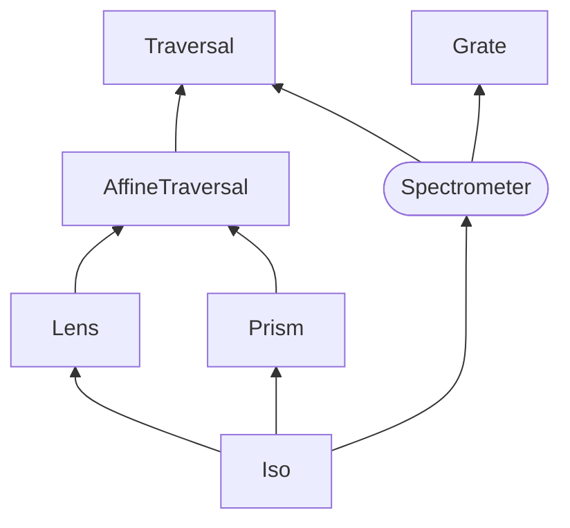

# Spectrometer Optics

Spectrometer is a Optics for data types of several values typed with the same type.

## Installation

UNDER CONSTRUCTION

## Quick start

```purescript
> import Data.Lens
> import Data.Lens.Spectrometer.Record

> record = { a: "Hello", b: "World" }

> over recordSpectrometer (_ <> "!") record
{ a: "Hello!", b: "World!" }

> toArrayOf recordSpectrometer record
["Hello","World"]

> review recordSpectrometer "Reviewed" :: { a :: String, b :: String }
{ a: "Reviewed", b: "Reviewed" }

> names = { a: "Alice", b: "Bob" }
> zipWithOf recordSpectrometer (\x y -> x <> " " <> y) record names
{ a: "Hello Alice", b: "World Bob" }
```

## Documentation

Spectrometer can be used as both of Traversal and Grate.



Spectrometer is Optics for types isomorphic to fixed-length arrays. For example:

- `Tuple5 a a a a a`
- `data T = T Int Int`
- `{a :: String, b :: String}`

Note that it cannot handle types that do not have a fixed length, such as Array, List.

There are several ways to create a Spectrometer.

```purescript
-- For forRecords
forRecords :: Spectrometer' { a :: Int, b :: Int, c :: Int, d :: Int } Int
forRecords = recordSpectrometer

-- For Data Types (via Generics)
data TestType = TestType Int Int Int Int

derive instance Generic TestType _

forDataTypes :: Spectrometer' TestType Int
forDataTypes = genericSpectrometer

-- For TupleN
forTupleN :: forall a. Spectrometer' (Tuple5 a) a
forTupleN = spectrometer

-- Most Generic Way

mostGeneric :: forall a. Spectrometer' (Pair a) a
mostGeneric = represented

{-
Type:

represented
  :: forall i f a b
   . Traversable f
  => Representable i f
  => Spectrometer (f a) (f b) a b
-}
```

## Implementation

This implementation involves the Representable type class:

```purescript
class Distributive f <= Representable i f | f -> i where
  tabulate :: forall a. (i -> a) -> f a
  index :: forall a. f a -> i -> a
```

Consider the following new Profunctor-related classes:

```purescript
class Profunctor p <= Thicken p where
  thicken :: forall i f a b. Traversable f => Representable i f => p a b -> p (f a) (f b)
```

This class is this class is a subclass of Profunctor and (possibly) a superclass of Closed and Wander.

```purescript
class Profunctor P <= Thicken p <= Closed p, Wander p
```

Then define the Spectrometer.

```purescript
type Spectrometer s t a b = forall p. Thicken p => Optic p s t a b
```

`Closed p => Optics p s t a b` is a Grate and `Wander p => Optics p s t a b` is a Traversal, so the Spectrometer is their intersection.

## Issues?

### Composability

It seems intuitive to synthesize multiple Spectrometers. (since it represents a fixed length).

```purescript
composeSpectrometers :: forall s t a b s' t'
   . Spectrometer s t a b
  -> Spectrometer s' t' a b
  -> Spectrometer (s /\ s') (t /\ t') a b
```

However, such a function `composeSpectrometers` has not been created. It may not be possible theoretically.

### Star Instance

Star instances can be defined in two ways.

```purescript
instance Applicative f => Thicken (Star f) where
  thicken = thickenFromWander

instance Distributive f => Thicken (Star f) where
  thicken = thickenFromClosed
```

What does this mean?
I chose thickenFromWander for traverseOf this time, but is it appropriate?
